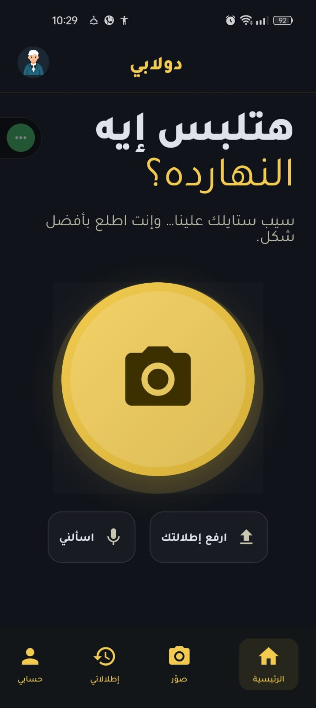
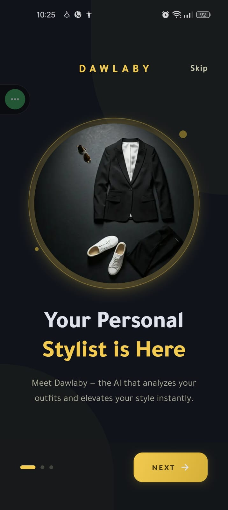
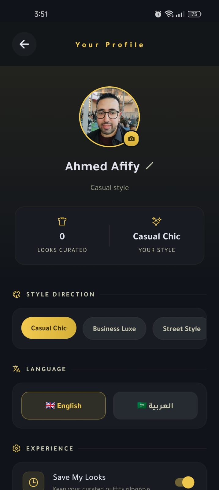
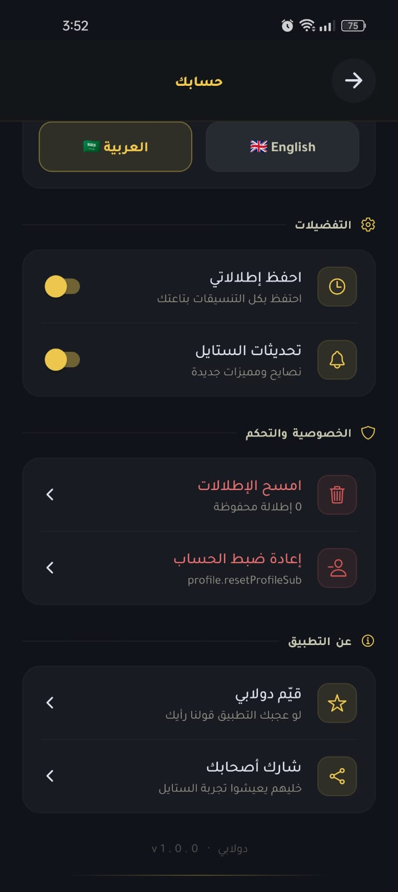

<p align="center">
  
</p>

<h1 align="center">DAWLABY</h1>

<p align="center">
  
</p>

<p align="center">
  <strong>Your AI-Powered Personal Fashion Stylist</strong>
</p>

<p align="center">
  
  
  
  
  
</p>

<p align="center">
  Dawlaby analyzes your outfits using AI vision, gives personalized style suggestions, and acts as your on-demand fashion advisor — all from your phone's camera or gallery.
</p>

---

## ✨ Features

### 📸 Smart Camera

- Full outfit or portrait mode capture with real-time viewfinder
- Flash control (on / off / auto) and front/back camera toggle
- Gallery picker with automatic image compression & optimization

### 🤖 AI Outfit Analysis

- Powered by **Google Gemini** vision models
- Detects clothing items, color palette, and overall style vibe
- Suggests matching occasions (casual, business, evening, etc.)
- Provides stylist-grade improvement suggestions and a personal stylist note

### 🎙️ Voice Fashion Assistant

- Ask fashion questions by voice with real-time audio transcription
- Quick-question shortcuts for common style queries
- Rich results with tips, things to avoid, and detailed answers

### 📤 Photo Upload & Context

- Upload from gallery with full outfit or single item mode
- Add occasion tags and custom notes for context-aware analysis
- Smart image processing (resize, compress) for fast AI response

### 📋 Look History

- Grid and list views of all past outfit analyses
- Tap to revisit full suggestions for any previous look
- Delete individual entries or clear all history

### 👤 Profile & Preferences

- Custom avatar, name, and bio
- Style goal selector (Casual Chic, Business Luxe, Street Style, Minimalist, Maximalist, Athleisure)
- Save history toggle, notification preferences
- Data & privacy controls (clear history, reset profile)

### 🌍 Multilingual & RTL

- Full **English** and **Arabic** support
- Automatic RTL layout when Arabic is selected
- Arabic typography with Cairo and Tajawal fonts

### 🎨 Premium Dark Theme

- Luxurious dark UI with gold accent palette
- Glassmorphism effects, blur overlays, and gradient highlights
- Smooth Reanimated-powered animations and micro-interactions throughout

---

## 📱 Screenshots

|                   Onboarding                   |                 Smart Analysis                 |                Voice Assistant                 |
| :--------------------------------------------: | :--------------------------------------------: | :--------------------------------------------: |
|  |  |  |

|                  Look History                  |               Profile (English)                |             Profile (Arabic - RTL)             |
| :--------------------------------------------: | :--------------------------------------------: | :--------------------------------------------: |
|  |  |  |

---

## 🛠️ Tech Stack

| Layer                    | Technology                                               |
| ------------------------ | -------------------------------------------------------- |
| **Framework**            | [Expo](https://expo.dev) SDK 54 (New Architecture)       |
| **Language**             | TypeScript 5.9                                           |
| **UI Runtime**           | React Native 0.81                                        |
| **Navigation**           | Expo Router (file-based, typed routes)                   |
| **AI Backend**           | Google Gemini API (vision + text + audio)                |
| **Animations**           | React Native Reanimated 4                                |
| **Storage**              | react-native-mmkv (synchronous key-value)                |
| **Internationalization** | i18next + react-i18next + expo-localization              |
| **Camera**               | expo-camera + expo-image-picker + expo-image-manipulator |
| **Audio**                | expo-audio (voice recording & transcription)             |
| **Styling**              | expo-blur, expo-linear-gradient, expo-haptics            |
| **Testing**              | Jest + @testing-library/react-native                     |
| **Build**                | EAS Build (development, preview, production profiles)    |
| **Animations**           | React Native Reanimated 4                                |
| **Storage**              | react-native-mmkv (synchronous key-value)                |
| **Internationalization** | i18next + react-i18next + expo-localization              |
| **Camera**               | expo-camera + expo-image-picker + expo-image-manipulator |
| **Audio**                | expo-audio (voice recording & transcription)             |
| **Styling**              | expo-blur, expo-linear-gradient, expo-haptics            |
| **Testing**              | Jest + @testing-library/react-native                     |
| **Build**                | EAS Build (development, preview, production profiles)    |

---

## 📁 Project Structure

```
dawlaby/
├── app/                    # Screens (file-based routing)
│   ├── _layout.tsx         # Root layout & providers
│   ├── index.tsx           # Splash → onboarding / home redirect
│   ├── onboarding.tsx      # 3-step onboarding walkthrough
│   ├── home.tsx            # Main dashboard with recent looks
│   ├── camera.tsx          # Camera capture (photo & portrait modes)
│   ├── upload.tsx          # Gallery upload with occasion & notes
│   ├── suggestions.tsx     # AI analysis results display
│   ├── voice.tsx           # Voice fashion assistant
│   ├── profile.tsx         # User profile & app settings
│   └── history/            # Look history (grid/list + detail)
├── components/
│   ├── common/             # Shared UI (Screen, TopBar, FadeIn, etc.)
│   ├── camera/             # Camera-specific components
│   ├── history/            # History cards (grid & list)
│   ├── onboarding/         # Onboarding slides & visuals
│   ├── profile/            # Profile sections, toggles, stats
│   ├── suggestions/        # Suggestion result sections
│   └── voice/              # Voice processing steps & headers
├── hooks/
│   ├── suggestions/        # useSuggestionAI, useSuggestionAnimations
│   ├── voice/              # useRecorder, useVoiceAI, useVoiceAnimations
│   ├── useAsyncError.ts    # Async error boundary hook
│   └── useSyncDirectionWithLang.ts
├── utils/
│   ├── gemini.ts           # Gemini API client (vision, text, audio, raw)
│   ├── storage.ts          # MMKV storage wrapper
│   ├── i18n.ts             # i18next initialization & language switching
│   ├── history.ts          # History CRUD operations
│   ├── profile.ts          # Profile persistence
│   ├── preferences.ts      # Preferences persistence
│   ├── normalization.ts    # Param & color normalization
│   └── errorLogger.ts      # Error logging utility
├── constants/
│   ├── app.ts              # App name variants
│   ├── colors.ts           # Full dark theme color system
│   ├── common.ts           # Occasions, quick questions, status labels
│   ├── env.ts              # Environment variables (API keys)
│   ├── fonts.ts            # Font family constants
│   └── user.ts             # Default profile, prefs, style goals
├── store/
│   └── DirectionContext.tsx # RTL/LTR direction context provider
├── types/
│   └── index.ts            # TypeScript interfaces & enums
├── locales/
│   ├── en.json             # English translations
│   └── ar.json             # Arabic translations
├── assets/images/          # App icons, splash, onboarding visuals
└── __tests__/              # Unit tests (app, components, hooks, utils)
```

---

## 🚀 Getting Started

### Prerequisites

- [Node.js](https://nodejs.org/) (LTS recommended)
- [Expo CLI](https://docs.expo.dev/get-started/installation/)
- [EAS CLI](https://docs.expo.dev/build/setup/) for builds

### Installation

```bash
# Clone the repository
git clone https://github.com/ahmedalianz/dawlaby.git
cd dawlaby

# Install dependencies
npm install
```

### Environment Setup

Create a `.env` file in the project root:

```env
GEMINI_API_KEY=your_gemini_api_key_here
```

> Get a free Gemini API key at [Google AI Studio](https://aistudio.google.com/apikey)

### Running the App

```bash
# Start the development server
npx expo start

# Run on Android
npx expo start --android

# Run on iOS
npx expo start --ios
```

### Building with EAS

```bash
# Development build (internal distribution)
eas build --profile development --platform android

# Preview build
eas build --profile preview --platform android

# Production build
eas build --profile production --platform android
```

---

## 🧪 Testing

```bash
# Run all tests
npm test

# Run tests in watch mode
npm run test:watch

# Run with coverage report
npm run test:coverage
```

---

## 📄 License

This project is private and not open-sourced.

---

<p align="center">
  Built with ☕ and ✨ by <a href="https://github.com/ahmedalianz">Ahmed Ali</a>
</p>
